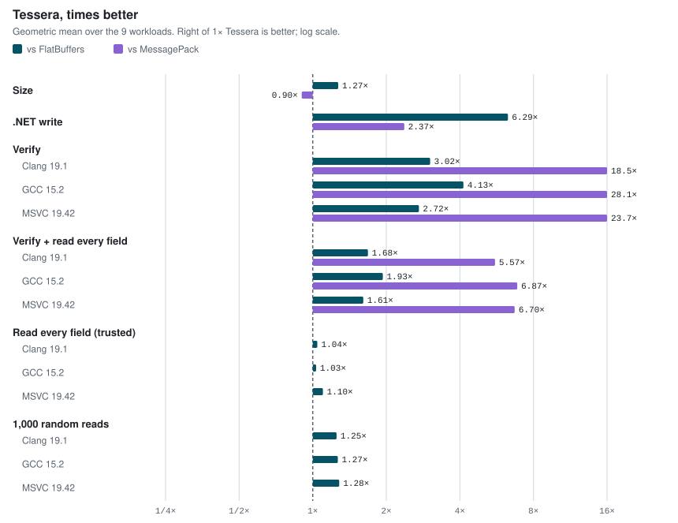
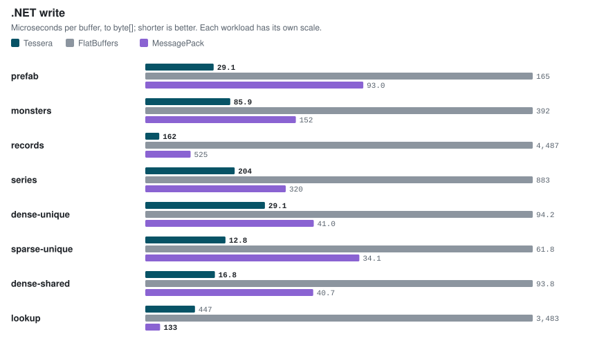
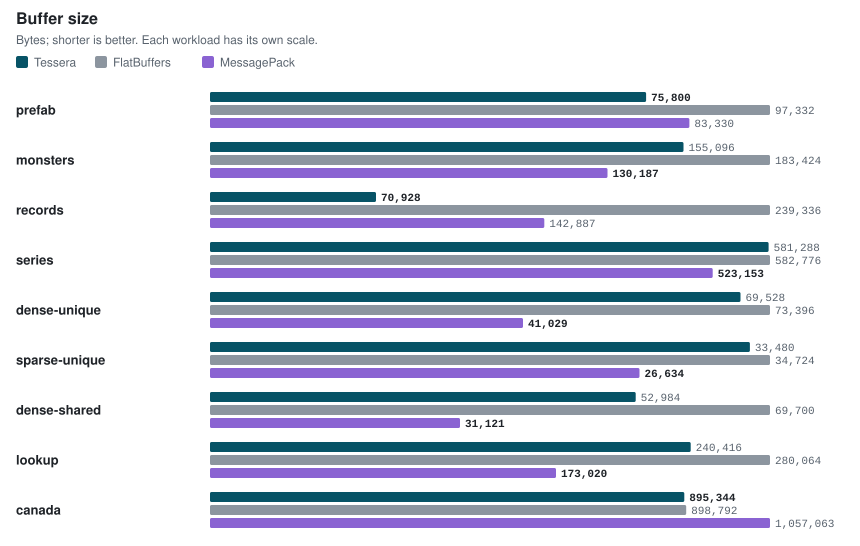
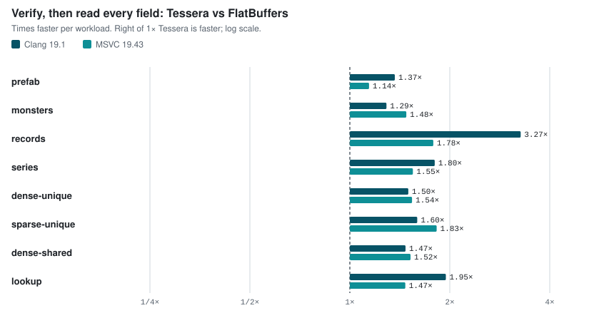
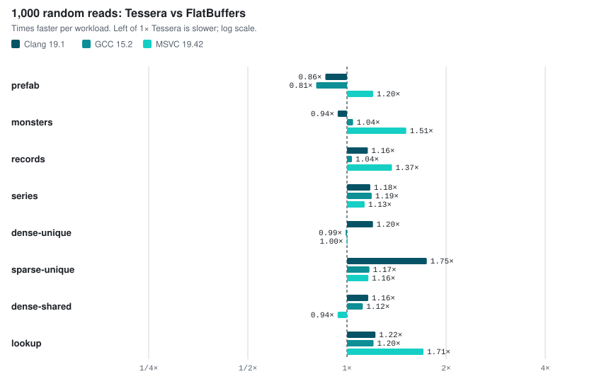
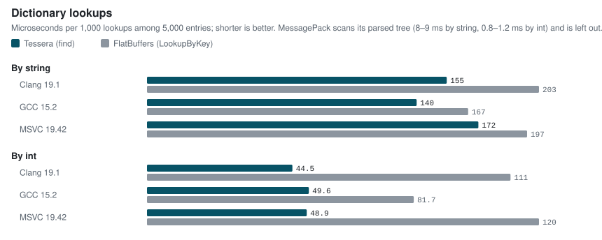

<p align="center">
  <picture>
    <source media="(prefers-color-scheme: dark)" srcset="docs/images/tessera-icon-dark.svg">
    
  </picture>
</p>

<h1 align="center">Tessera</h1>

<p align="center">
  Binary buffers from plain .NET objects, read in place by C++20.<br>
  No IDL, no parsing, and no allocations on the read side.
</p>

## 1. What is Tessera?

Tessera is a serialization format and toolchain for moving structured data from .NET to C++. A Roslyn source generator
turns ordinary C# classes, records and structs into allocation-free writers, and writes a readable C++20 header of
view classes for the same types. C++ verifies a buffer once and then reads it where it lies: every accessor is a
plain load.

```text
C# models: plain classes, records and structs
        │
        │  source generator, at build time
        ▼
.NET writer ───► buffer: presence bits, inline values, forward offsets, optional schema
                    │
                    ▼
          C++20 tessera::Reader<T>: verifies once
                    │
                    ▼
          generated views: plain loads, no parse, no allocation
```

It was built for game tooling: UI prefabs, records, scene graphs and time series authored in .NET and loaded by a C++
engine. The C# models are the schema, so both sides are generated from the same source and cannot drift apart. A
buffer can also carry a compact schema of its own, so a reader built from an older or newer version of the models
still reads it.

## 2. Why should I care?

Tessera combines properties that usually come from different libraries:

- the zero-copy reads of FlatBuffers: no parse step, and data is read where it lies;
- fast, compact writing straight from plain objects, without an IDL;
- schema evolution by member name, with real absence: a member that was never set is not its default value.

What you get:

- **Fast writes.** 6× faster than FlatBuffers and 1.7× faster than MessagePack-CSharp on the benchmark workloads, with
  no allocations besides the resulting array (with a reused writer, none at all for types without dictionaries).
- **Fast, safe reads.** Verifying a buffer is 3.1–3.5× faster than FlatBuffers' verifier; verifying and then reading
  every field is 1.5–1.7× faster (geometric means per compiler). After verification, every access is a plain load.
- **Small buffers.** Default values and absent members take no space, and equal strings are stored once: buffers are
  up to 70% smaller than FlatBuffers' (1.3× on the geometric mean).
- **Your classes are the schema.** No IDL and no attributes: classes, records, structs, enums, nullable values,
  lists, dictionaries, and abstract classes or interfaces as unions. Unsupported types are reported at compile time
  with a suggested replacement.
- **Readable C++.** One header per type, `std::optional` for nullable members, `std::string_view` for strings,
  `enum class` with your names, and `const S&` straight into the buffer for plain structs.
- **Schema evolution by name.** Add, delete, reorder and rename members anywhere, with no field ids or deprecated
  slots; old and new readers keep working.
- **Hardened.** About 450,000 fuzzed buffers per test run under GCC's AddressSanitizer and UBSan, MSVC and Clang, and
  every change to the format or the reader is benchmarked against the commit before it.
- **Apache-2.0** licensed.

## 3. 30-second example

Tessera is not on nuget.org yet, so build the package once:

```shell
dotnet pack src/Tessera -c Release -o artifacts
```

Add `artifacts` as a package source in your `nuget.config`, reference the package, and choose where the C++ headers
go:

```xml
<ItemGroup>
  <PackageReference Include="Tessera" Version="0.1.0-preview" />
</ItemGroup>
<PropertyGroup>
  <!-- After each build, the generated headers and the C++ runtime headers are written here. -->
  <TesseraCppOutputDir>cpp/generated</TesseraCppOutputDir>
</PropertyGroup>
```

NuGet caches packages by version: after repacking the same version, delete `~/.nuget/packages/tessera`.

Write your models as ordinary classes, records and structs (no attributes, base classes or IDs) and serialize them:

```csharp
using Tessera;

namespace Game;

public enum Faction : byte { Neutral, Red, Blue }
public struct Vec3 { public float X, Y, Z; }          // plain struct: stored inline

public class Monster
{
    public string? Name;
    public short Hp = 100;                            // equal to its default: not stored
    public int? Mana;                                 // nullable: absence is visible in C++
    public Vec3 Position;
    public Faction Faction;
    public List<Weapon>? Weapons;
    public Item? Loot;                                // abstract: a union of the classes deriving from it
}

public class Weapon { public string? Name; public int Damage; }
public abstract class Item { }
public sealed class Potion : Item { public int Heal; }
public sealed class Key : Item { public uint Door; }

// ...
byte[] bytes = TesseraSerializer.Serialize(monster);

// Or allocation-free, reusing a writer:
var writer = new TesseraWriter();
ReadOnlySpan<byte> span = TesseraSerializer.Write(writer, monster);
```

Serializing a `Monster` is what makes it a model: the generator follows its members to `Weapon`, `Vec3`, `Faction`
and the classes deriving from `Item`. An attribute is only needed for models that the project never serializes with
a known type, such as types only C++ reads (see [Which types are models](#which-types-are-models)).

Read it in C++, with `cpp/generated` on the include path. The header that includes every model type is named after
the assembly (here `Game`):

```cpp
#include "Game.tessera.hpp"   // or only one type: "game/Monster.tessera.hpp"

// data must be 8-byte aligned (from std::vector<std::uint64_t>, new or malloc, for example)
tessera::Reader<game::Monster> reader(data, size);            // verifies the buffer
if (!reader) return fail(tessera::to_string(reader.error()));

game::Monster m = reader.root();
std::string_view name = m.name();
std::int16_t hp = m.hp();                                   // 100 when it was not stored
if (std::optional<std::int32_t> mana = m.mana()) use(*mana);
const game::Vec3& pos = m.position();                       // points into the buffer
for (game::Weapon w : m.weapons()) use(w.name(), w.damage());
if (game::Potion p = m.loot().as_potion()) use(p.heal());
```

Views are two pointers: keep the buffer (and the `Reader`) alive while you use them. A complete, buildable version is
in [samples/Quickstart](samples/Quickstart).

Change the models whenever you like: add, delete or reorder members, and rename one with `[TesseraName("OldName")]`.
Buffers carry a compact schema, so readers built from older or newer models still read them (see
[Schema evolution](#schema-evolution)).

## 4. Performance

Environment: Intel Core i9-14900, Windows 11, .NET 10.0.12. C++ with clang-cl 19.1 and MSVC 19.43, each compiler
with the same flags for every library (optimized, AVX2). Against FlatBuffers 25.12.19, MessagePack-CSharp 3.1.10 and
msgpack-cxx 9.0.0. Medians of interleaved rounds.

There are eight workloads: a UI prefab (400 objects with polymorphic components), a game world (1,000 monsters),
2,000 sparse records (40 optional fields each), a 20,000-sample time series, three scene graphs of 1,024 nodes (dense,
sparse, and 16 distinct nodes repeated) and two dictionaries of 5,000 entries. Every library writes the same C#
objects, and every C++ reader computes a checksum over every field, which must match the C# objects before anything
is timed.

Summary: how many times faster (or smaller) Tessera is than FlatBuffers. A safe read verifies the buffer, then reads
every field.

| Workload | .NET write | Size | Safe read, Clang | Safe read, MSVC |
|---|---:|---:|---:|---:|
| prefab | 5.67× | 1.28× | 1.37× | 1.14× |
| monsters | 4.56× | 1.18× | 1.29× | 1.48× |
| records | 27.74× | 3.37× | 3.27× | 1.78× |
| series | 4.33× | 1.00× | 1.80× | 1.55× |
| dense-unique | 3.24× | 1.06× | 1.50× | 1.54× |
| sparse-unique | 4.83× | 1.04× | 1.60× | 1.83× |
| dense-shared | 5.57× | 1.32× | 1.47× | 1.52× |
| lookup | 7.79× | 1.16× | 1.95× | 1.47× |

<picture>
  <source media="(prefers-color-scheme: dark)" srcset="docs/images/benchmarks/summary-dark.svg">
  
</picture>

These numbers describe these workloads on this machine; they are not guarantees. Measure with your own data.

### .NET write

<picture>
  <source media="(prefers-color-scheme: dark)" srcset="docs/images/benchmarks/write-dark.svg">
  
</picture>

### Buffer size

<picture>
  <source media="(prefers-color-scheme: dark)" srcset="docs/images/benchmarks/size-dark.svg">
  
</picture>

MessagePack stores small integers in one or two bytes, so it is smaller on six of the eight workloads; Tessera is
smaller on the prefab and the sparse records. Tessera keeps values fixed-width so that they can be read in place.

### C++: verify, then read every field

<picture>
  <source media="(prefers-color-scheme: dark)" srcset="docs/images/benchmarks/safe-read-dark.svg">
  
</picture>

### C++: 1,000 random reads

<picture>
  <source media="(prefers-color-scheme: dark)" srcset="docs/images/benchmarks/random-access-dark.svg">
  
</picture>

### Dictionary lookups

<picture>
  <source media="(prefers-color-scheme: dark)" srcset="docs/images/benchmarks/lookups-dark.svg">
  
</picture>

### Where Tessera is slower

- **Random reads of wide objects with Clang:** up to 1.24× slower. Locating a member preceded by many members of
  other sizes costs a few more instructions than a vtable lookup.
- **Reading every field of the union-heavy prefab with MSVC:** 1.63× slower. With Clang, the same code runs about as
  fast as FlatBuffers.
- **Reading dictionary entries by index** with Clang (1.71×) and MSVC (1.09×): keys and values are two vectors, so an
  entry takes more loads than FlatBuffers' table per entry. Lookups by key match or beat FlatBuffers'.
- **Opening a buffer and reading one field:** both take 2–5 ns; FlatBuffers is up to 1 ns faster on the records,
  series and lookup workloads.
- **Writing dictionaries:** 3.4× slower than MessagePack, which writes entries unsorted (and can then only scan
  them). FlatBuffers sorts too, and is 7.8× slower than Tessera.

The full list, computed from the results, is in [docs/BENCHMARKS.md](docs/BENCHMARKS.md).

Reproduce everything (it also fetches FlatBuffers and msgpack-cxx, SHA-256 pinned, into `.deps/`):

```shell
powershell scripts/bench.ps1
```

It writes every table to [docs/BENCHMARKS.md](docs/BENCHMARKS.md), the raw samples to `docs/benchmarks/*.json` and
these charts to `docs/images/benchmarks`. Every change to the format or the reader is also measured against the
commit before it with `scripts/ab.ps1` (see [How to build](#how-to-build)).

## 5. Architecture

### Presence bits instead of a vtable

An object is a presence bitmap followed by the cells of its present members. Members that are absent, null or equal
to their default take no space at all, and bools live in the bitmap itself (two bits: present, value).

```text
   0          4W              4W+F
   ┌──────────┬───────────────┬───────┬───────┬─────────┬────────┬───
   │ presence │ fixed cells   │ cell  │ cell  │ offset  │ offset │ …     only present cells are stored,
   │ bitmap   │ (opt-in)      │ 8 B   │ 4 B   │ string  │ vector │       sorted by alignment, then size
   └──────────┴───────────────┴───────┴───────┴─────────┴────────┴───

   position of a cell = 4W + F + Σ size × popcount(presence & mask)
                        one popcount per run of equal-size cells
```

The generator knows every type's layout, so the masks and sizes are compile-time constants in the C++ header: reading
a member is a bit test, one or a few popcounts and a load, with no vtable and no hash. Values of 8 bytes or less and
plain structs (C layout) are stored inline; strings, vectors, objects and union members sit behind forward offsets.

### Fixed cells for members that are always set

Members marked `[TesseraKeepDefault]` (scalars, enums and plain structs) are always stored, so they need no presence
bit: they come first, at constant positions, and reading one is a single load. On the time series workload, that makes
random reads 19–29% faster and verification 9–18% faster, at the same size.

### Written back to front

The writer builds a buffer from the end, so every offset points forward and cycles are impossible. With
`Sharing.Strings` (the default), equal strings are written once; with `Sharing.All`, equal strings, vectors, shared
structs and objects are written once, and the buffer becomes a DAG. Writers are generated per type: no reflection, and
with a reused `TesseraWriter` no allocations (sorting a dictionary's keys allocates about 100 bytes).

### Verify once, then plain loads

`tessera::Reader<T>` checks the whole buffer before the first access: the header, every object's bitmap and cells,
every offset (non-null where required, forward, in bounds and aligned), string and vector lengths, union tags, and
nesting depth, plus UTF-8 if you ask. The verifier is generated per type. Shared items in a DAG
would be visited once per path, which grows exponentially with nesting; when the walk outgrows the buffer, the
verifier switches to checking each shared item once (the only case in which it allocates, for its memo). After
verification, accessors are bounds-free loads.

### Same models: compile-time positions; other models: translate once

```text
buffer fingerprint == compiled fingerprint  ──►  compile-time positions, no lookups
                   !=                       ──►  parse the buffer's schema once, match members by the
                                                 xxHash64 of their names, translate the buffer into
                                                 the reader's layout, then compile-time positions
```

Every buffer records a fingerprint of its root type's layout. A reader built from the same models takes the fast
path. A reader built from other models matches members by name once, when the `Reader` is opened, and translates the
buffer into a copy in its own layout, so every read afterwards is the same plain load as on the fast path; members
it does not find read as absent. Translation costs one copy of the buffer at open (items shared in the buffer stay
shared), and the copy lives as long as the `Reader`. The binder compares layouts structurally and never trusts the
buffer's fingerprints for safety. See [docs/FORMAT.md](docs/FORMAT.md) for the complete wire format.

### Generated code

| Generated | Where | Contents |
|---|---|---|
| C# writers | compiled into your assembly | one writer per type, presence bits computed while writing, no reflection |
| C++ headers | `TesseraCppOutputDir` after each build | one header per type (by C++ namespace) and one per assembly that includes them all |
| C++ runtime | copied next to the headers | header-only: views, `Reader`, verifier, schema translation, JSON dump |

## 6. Types

| C# | C++ accessor returns |
|---|---|
| `bool`, `sbyte` … `ulong`, `float`, `double` | the same scalar type (`std::int32_t` …) |
| `char` | `char16_t` |
| enum (any integer base, `[Flags]` too) | `enum class` with the same values (flags get `\|`, `&`, `~`) |
| `T?` for value types | `std::optional<T>` |
| `string` | `std::string_view` (UTF-8; null → `data() == nullptr`) |
| struct with only unmanaged fields | a C++ struct of the same layout, returned as `const S&` (stored inline) |
| class, record, struct with references | a view class with one accessor per member |
| `T[]`, `List<T>`, `IReadOnlyList<T>`, any `IEnumerable<T>` | `tessera::Vector<T>` (random access, range-for); `List<int?>` gives `tessera::Vector<std::optional<std::int32_t>>` |
| `Dictionary<K, V>`, `IReadOnlyDictionary<K, V>`, any `IDictionary<K, V>` (keys: integers, chars, enums, strings) | `tessera::Map<K, V>`: `find(key)` and `contains(key)` (binary search), `keys()`, `values()` |
| abstract class or interface | a union view: `type()`, `as_potion()` … |

Public fields and properties are serialized, as are internal ones declared in the same assembly. Properties need a
setter or must be auto-properties. Leave a member out with `[TesseraIgnore]`, `[IgnoreDataMember]` or `[NonSerialized]`.
`DateTime`, `Guid`, `decimal` and similar types have no portable C++ form; they are reported at compile time with a
suggested replacement (for example `DateTime.Ticks` as a `long`).

### Which types are models

A class, record or struct is a model when its project does one of these:

- **serializes it:** `TesseraSerializer.Serialize(value)` or `Write(writer, value)`, where the compiler knows the type
  of `value`;
- **uses it in a model:** as a member, as the element or value type of a collection, or as a concrete class deriving
  from the type of an abstract or interface member (every public or internal one in the project, unless
  `[TesseraUnion]` lists them);
- **marks it:** `[Tessera]` on the type, or `[assembly: TesseraRoot(typeof(Monster))]` in the project, for types you
  cannot or would rather not edit.

`[Tessera]` is optional. With or without it:

- **Every call has a writer.** A `Serialize` or `Write` call whose type is known compiles only if a writer exists
  for that type. Calls that could never work, for example with an abstract type, a collection or a private class,
  are compile errors. Only generic code hides the type: a call that serializes a type parameter `T` is reported
  (TESSERA010, info), and the types it writes must be models for another reason.
- **A bare `[Tessera]` changes nothing in its own project.** On a type that is already a model there, it changes no
  byte of any buffer and no line of the generated C# or C++ (the tests check this). It changes how other projects
  see the type, as the table below shows.

What the attribute adds:

| | Without `[Tessera]` | With `[Tessera]` or `[assembly: TesseraRoot]` |
|---|---|---|
| Model | when its project serializes it or a model uses it | always: C++ gets its header even if no C# code writes it |
| Buffers and generated code | the same | the same |
| Union member of this project's abstract types | yes, when public or internal and not generic | yes |
| Union member of another project's abstract types | no | yes |
| Member initializers visible to other projects | when its own project treats it as a model | yes |
| Stable type name (the source of union tags) | the C# type name | the C# type name, or `[Tessera("Name")]` |
| Under `TesseraRequireAttribute` | error TESSERA012 | accepted |

Member initializers are compiled into constructors, which the generator cannot read in a referenced assembly. So
each project's generator records the initializers of its own models in its assembly, and other projects read them
from there. When a type's project does not treat it as a model, nothing is recorded: another project that uses the
type takes zero as the default of its members and warns (TESSERA011). Mark those types in their project, list them in
`TesseraRoot` there, or give the members `[DefaultValue]`.

**Strict mode.** Set `<TesseraRequireAttribute>true</TesseraRequireAttribute>` to require a mark on every model
class, record and struct with references (TESSERA012), so that no type joins the wire format unannounced. Enums,
plain structs and abstract union bases need no mark.

### Attributes

| Attribute | Effect |
|---|---|
| `[TesseraName("old")]` | wire name of a member, so it can be renamed in C# |
| `[DefaultValue(x)]`, initializer (`= 100`) | the default that is omitted from buffers and returned by C++ when absent |
| `[TesseraKeepDefault]` | always store the member; scalars, enums and plain structs then sit at a fixed position with no presence bit |
| `[TesseraShared]` | store a struct once behind an offset (useful for large repeated structs with `Sharing.All`) |
| `[TesseraUnion(typeof(A), typeof(B))]` | the types allowed in an abstract or interface member (default: see [Which types are models](#which-types-are-models)) |
| `[Tessera]`, `[Tessera("Name")]` | optional: makes the type a model; the name fixes its union tag (needed when two union members share a C# name) |
| `[assembly: TesseraRoot(typeof(A), ...)]` | makes types models without editing them |

## 7. Advanced features

### The wire contract

There is no schema file: the C# models are the schema, so the contract between writers and readers is implicit in
them. A buffer depends on exactly these parts of the models:

| Part of a model | Role on the wire | Changing it |
|---|---|---|
| Member name: the C# name, or `[TesseraName]` | identifies the member (`xxHash64` of the name) | makes a new member; the old one reads as absent. Keep the old name with `[TesseraName("OldName")]` |
| Member kind: scalar type, string, object, vector and element kind, union, struct layout | must match for the member to be read | makes a new member. Some changes keep the kind: `int` ↔ `int?`, `int` ↔ an enum based on `int`, `List<T>` ↔ `T[]`, one class ↔ another (members match by name) |
| Member default: initializer or `[DefaultValue]` | not stored: writers omit members equal to it, readers return their own | changes what old buffers read: a member left out because it equaled the old default now reads as the new one |
| Names of union member types (without namespace), or `[Tessera("Name")]` | the union tag (`xxHash32` of the name) | old buffers' values of that type read as an unknown union member. Keep the old name with `[Tessera("OldName")]` |
| Everything else: namespaces, the names of other types, member order, fields or properties, class or record | nothing | is free |

Defaults are the easy part to miss. If a member's default may change, mark it `[TesseraKeepDefault]` (always stored)
or write with `WriteDefaults = true`. A default can also change without an edit to the member: when a type from
another project starts or stops being a model there, its initializers become visible or invisible to your project
(see [Which types are models](#which-types-are-models)).

### Schema evolution

Members are identified by name, not by position. In FlatBuffers a field's slot is its identity: new fields go at the
end (or every field needs an explicit `id`), deleted fields stay in the schema as `deprecated`, and moving a field
breaks old buffers. In Tessera:

- **Reorder members freely**, and turn fields into properties or back. The layout does not depend on declaration
  order (cells are sorted by alignment, size and name hash), so the layout and the fingerprint stay the same, and
  readers built from either version keep using compile-time positions.
- **Add and delete members anywhere.** Each buffer carries a compact schema, about 12 bytes per member, which you can
  turn off. A reader built from other models matches members by name through it, once per buffer, and translates the
  buffer into its own layout. Members missing from a buffer read as absent, with the reader's default (a
  `[TesseraKeepDefault]` member is always stored, so it reads as present, with its default).
- **Rename** a member by keeping its wire name: `[TesseraName("OldName")]`.
- **Changing a member's kind** makes it a different member: readers of the other version see it as absent. A
  dictionary whose value type changes keeps its keys and has no values there; one whose key type changes is empty.
- **Unions:** new member types can be added. Old readers see an unknown `type()`, and every `as_x()` is empty.
- Without the schema (`IncludeSchema = false`), a reader accepts only buffers whose fingerprint matches its own
  (`Error::SchemaMismatch` otherwise): adding or deleting members then breaks old buffers, reordering does not.

The C++ tests read old buffers with new readers and new buffers with old readers, with MSVC, GCC and Clang: the
model versions are in [tests/Tessera.Tests/Evolution.cs](tests/Tessera.Tests/Evolution.cs), the checks in
[tests/cpp/interop_test.cpp](tests/cpp/interop_test.cpp).

### Write options

`TesseraSerializer.Serialize(value, new TesseraOptions { ... })`:

| Option | Default | |
|---|---|---|
| `Sharing` | `Strings` | `None`: fastest writes. `Strings`: equal strings stored once. `All`: equal strings, vectors and objects stored once (the buffer becomes a DAG) |
| `IncludeSchema` | `true` | embed the schema so other model versions can read the buffer |
| `WriteDefaults` | `false` | also store members equal to their default |
| `MaxDepth` | `128` | nesting limit (objects and vectors); matches C++ `Options::max_depth` |

### Dictionaries

Dictionaries are written with their keys sorted (strings by code point, the order of their UTF-8 bytes), so C++ finds
a key by binary search:

```cpp
if (auto stock = shop.items().find("item-0042")) use(stock->count());
bool known = shop.prices().contains(7);
```

### Verification options and trusted buffers

```cpp
tessera::Options strict;
strict.utf8 = true;                                   // also validate UTF-8 (default: false)
strict.max_depth = 64;                                // nesting limit (default: 128)
strict.max_items = 100'000;                           // objects and vectors verified (default: 2^24)
tessera::Reader<game::Monster> checked(data, size, strict);

// Buffers you wrote yourself, with exactly these models: no verification.
tessera::Reader<game::Monster> trusted(data, size, tessera::trusted);
```

### Models across assemblies

Models can span several assemblies. An assembly's headers also cover the model types it uses from other assemblies,
and the headers for one type are identical whichever assembly wrote them, so including several assemblies' headers in
one file works. A type that two different model versions define stops the build with an `#error`. The initializers of
another project's types are visible only when that project treats them as models (see
[Which types are models](#which-types-are-models)).

### C++ naming and output

MSBuild properties: `TesseraCppOutputDir`; `TesseraCppHeaderName` (default `<AssemblyName>.tessera.hpp`);
`TesseraCppNamespace` (default: the C# namespace in lower case); `TesseraCppNaming` (`snake_case` (default), `camelCase`,
`PascalCase` or `original`); `TesseraCppCopyRuntime` (default `true`).

### Debugging

`tessera::to_json(view)` prints any view, nested objects and vectors included.

## Requirements

- Using the package: .NET 8 or later, and any C# compiler from the .NET 8 SDK on.
- C++: a C++20 compiler and CMake 3.20 or later. Tested with MSVC 19.42, clang-cl 19, GCC 15 and Clang 21.
- Building this repository: the .NET 10 SDK, CMake, and Visual Studio 2022 or later with "Desktop development with
  C++" (add "C++ Clang tools for Windows" for clang-cl; Visual Studio 2026 needs CMake 4.2 or later); WSL with GCC and
  Clang for the Linux tests and the GCC benchmark.

## How to build

### 1. Build

```shell
dotnet build Tessera.slnx -c Release
```

### 2. Run tests

```shell
powershell scripts/test.ps1             # .NET tests, then C++ interop, fuzz and UTF-8 tests with MSVC
powershell scripts/test.ps1 -Asan       # also an MSVC AddressSanitizer build
powershell scripts/test.ps1 -Linux      # also GCC (AddressSanitizer + UBSan) and Clang in WSL
powershell scripts/test.ps1 -Package    # also packs Tessera and builds samples/Quickstart from the package
```

### 3. Run benchmarks

```shell
powershell scripts/bench.ps1            # writes docs/BENCHMARKS.md and docs/images/benchmarks
powershell scripts/bench.ps1 -NoGcc     # without WSL; -NoClang without clang-cl; -Quick for a short smoke run
```

### 4. Compare two commits

```shell
powershell scripts/ab.ps1 -Baseline <commit> -Candidate <commit>
powershell scripts/ab.ps1 -Candidate HEAD -Jcc   # with the JCC-erratum mitigation, to rule out code placement
```

Both commits are built in their own worktrees and run in alternating order; FlatBuffers and MessagePack run on both
sides as the noise control.

## Repository layout

| Folder | Contents |
|---|---|
| `src/Tessera` | runtime (writer, options, attributes) and the package project |
| `src/Tessera.Generator` | source generator: model analysis, wire layout, C# writers, C++ headers |
| `src/Tessera.Cpp` | build step that writes the generated headers to disk |
| `cpp/include/tessera` | C++20 header-only runtime: views, verifier, schema translation, JSON dump |
| `tests` | .NET tests, generator tests, C++ interop, fuzz and UTF-8 tests |
| `benchmarks` | the Tessera / FlatBuffers / MessagePack benchmark (C# writers, C++ readers) |
| `samples/Quickstart` | the example above, end to end |
| `docs` | [wire format](docs/FORMAT.md), [benchmark results](docs/BENCHMARKS.md) and their raw data, the README's charts |

## Third-party components

The Tessera package bundles no third-party code. The following projects are used to build, test and benchmark it; each
is distributed under its own license.

| Project | Used for | License |
|---|---|---|
| [FlatBuffers](https://github.com/google/flatbuffers) 25.12.19 | benchmarks: `flatc`, C++ headers, the C# runtime (built from source) | Apache-2.0 |
| [msgpack-c](https://github.com/msgpack/msgpack-c) (C++) 9.0.0 | benchmarks: the C++ MessagePack reader | BSL-1.0 |
| [MessagePack-CSharp](https://github.com/MessagePack-CSharp/MessagePack-CSharp) 3.1.10 | benchmarks: the .NET MessagePack writer | MIT |
| [xUnit.net](https://github.com/xunit/xunit) v3 | tests | Apache-2.0 |
| [Roslyn](https://github.com/dotnet/roslyn) (Microsoft.CodeAnalysis.CSharp 4.8) | building the source generator (not shipped) | MIT |
| [xxHash](https://github.com/Cyan4973/xxHash) | the hash algorithm of member names, union tags and fingerprints, implemented in `src/Shared/XxHash.cs` | BSD-2-Clause |

## Contributing

Bug reports and pull requests are welcome; see [CONTRIBUTING.md](CONTRIBUTING.md). Please report security problems
privately, as described in [SECURITY.md](SECURITY.md).

## License

Tessera is released under the [Apache License 2.0](LICENSE).

## Status

Tessera is a preview (0.1.0-preview, wire format version 2). The API and the wire format may change before 1.0; readers
reject buffers of other format versions. The package is not published to nuget.org yet.
